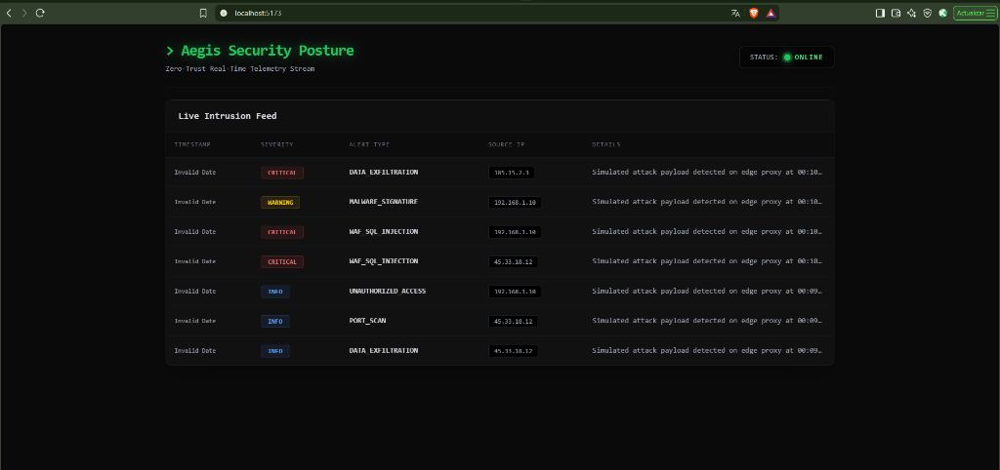
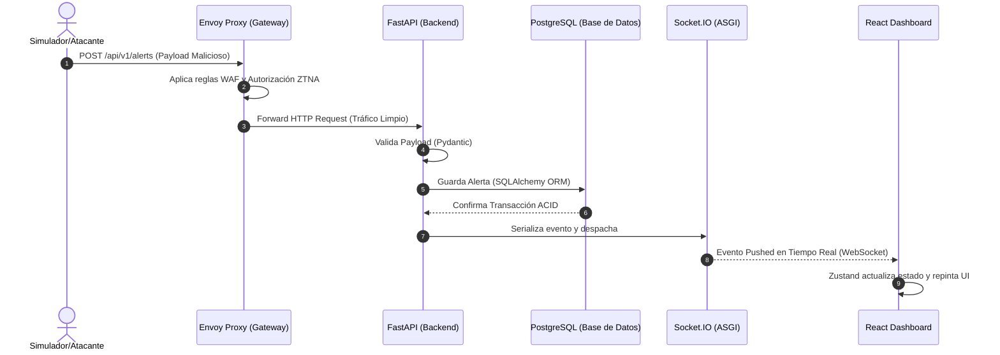

# Proyecto Aegis


<br>
<p align="center">
  
</p>
<br>

## Visión General

**Proyecto Aegis** es una plataforma integral de observabilidad de seguridad, orquestación DevSecOps y gestión de API Gateway bajo el paradigma **Zero-Trust**. Diseñado para operar en entornos Cloud-Native y ecosistemas de microservicios corporativos de alta demanda. 

Esta solución proporciona un plano de control centralizado y de clase mundial que automatiza las políticas de seguridad, empuja alertas de intrusión en tiempo real y gestiona dinámicamente el tráfico a través de un gateway distribuido, asegurando una postura de seguridad robusta e inmutable.

## Arquitectura y Patrones de Diseño

El proyecto se fundamenta en rigurosos principios de ingeniería de software para garantizar la escalabilidad, el bajo acoplamiento y la mantenibilidad a largo plazo:

### Flujo de Telemetría (Zero-Trust)



*   **Clean Architecture:** El backend está estrictamente dividido en capas (Domain, Application, Infrastructure, Presentation/Interfaces), aislando la lógica de negocio de los detalles de implementación (frameworks, bases de datos, APIs de terceros).
*   **Domain-Driven Design (DDD):** El núcleo de la aplicación modela entidades complejas como nodos perimetrales, alertas de seguridad y políticas de certificados (ej. `EndpointNode`, `SecurityAlert`, `SSLCertificatePolicy`).
*   **CQRS (Command Query Responsibility Segregation):** Separación lógica entre los canales de escritura (orquestación de seguridad, actualización de políticas WAF) y los canales de lectura (telemetría en tiempo real y dashboards analíticos).
*   **Zero-Trust Network Access (ZTNA):** Integración nativa con Envoy Proxy para autorizar y cifrar el tráfico lateral y de entrada por defecto, implementando un control de acceso granular y basado en identidad.
*   **Event-Driven & Real-Time Telemetry:** Uso de WebSockets (Socket.IO sobre ASGI) para la transmisión full-duplex de eventos y logs de auditoría en vivo al Security Posture Dashboard.

## Stack Tecnológico

### Backend
*   **Lenguaje:** Python 3.12
*   **Framework:** FastAPI (ASGI)
*   **ORM y Base de Datos:** SQLAlchemy 2.0 (PostgreSQL), Alembic para migraciones.
*   **Validación de Datos:** Pydantic V2
*   **Tiempo Real:** python-socketio

### Frontend
*   **Tecnologías:** React, TypeScript, Vite
*   **Estilizado:** Tailwind CSS
*   **Gestión de Estado:** Zustand (Global State Management)

### Infraestructura & DevSecOps
*   **Contenedores:** Docker & Docker Compose
*   **Gateway / Edge Proxy:** Envoy Proxy (Configuración dinámica y WAF routing)
*   **Bases de Datos:** PostgreSQL 15
*   **Automatización SSL:** CertManager custom worker (Let's Encrypt DNS-01)

## Módulos Principales

1.  **Aegis Gateway Controller:**
    Módulo para la mutación dinámica del plano de control de Envoy. Permite inyectar reglas de enrutamiento y endurecimiento de WAF al vuelo, sin disrupción del tráfico en vivo.
2.  **Telemetry & Audit Stream:**
    Canal de comunicación asíncrona implementado con FastAPI y Socket.IO para propagar métricas de salud de los microservicios y alertas de fuerza bruta directo al dashboard interactivo del operador.
3.  **CertManager (DNS-01):**
    Worker orquestado para la auditoría y renovación ininterrumpida de certificados TLS/SSL en el ecosistema, interactuando con los registros DNS de dominios perimetrales.
4.  **Security Posture Dashboard:**
    Interfaz central de mando que consume WebSockets para proyectar un mapa de calor táctico del tráfico, el estado de los contenedores (via integraciones con Portainer/Proxmox), y la superficie de vulnerabilidad detectada en SAST/DAST pipelines.

---

## Estructura del Monorepo

```text
aegis/
├── .env.example
├── .gitignore
├── docker-compose.yml
├── LICENSE.md
├── README.md
├── backend/
│   ├── alembic.ini
│   ├── alembic/
│   │   └── env.py
│   ├── Dockerfile
│   ├── requirements.txt
│   └── src/
│       ├── main.py
│       ├── application/
│       │   ├── schemas/
│       │   │   ├── alert.py
│       │   │   ├── certificate.py
│       │   │   └── endpoint.py
│       │   └── use_cases/
│       │       └── security_cases.py
│       ├── domain/
│       │   └── models/
│       │       ├── alert.py
│       │       ├── base.py
│       │       ├── certificate.py
│       │       └── endpoint.py
│       └── infrastructure/
│           ├── api/routers/
│           │   └── alerts.py
│           ├── database/
│           │   └── session.py
│           ├── websockets/
│           │   └── server.py
│           └── workers/
│               └── cert_manager.py
├── frontend/
│   ├── package.json
│   ├── tsconfig.json
│   └── src/
│       ├── components/
│       │   └── SecurityDashboard.tsx
│       ├── store/
│       │   └── useSecurityStore.ts
│       └── types/
│           └── security.ts
└── infrastructure/
    └── envoy/
        └── envoy.yaml
```

## Guía de Instalación y Pruebas Locales

Para ejecutar el Proyecto Aegis en tu entorno local y probar el flujo de telemetría de red, sigue estos pasos:

### 1. Preparación del Entorno
Clona el repositorio y configura las variables de entorno basadas en el template proporcionado:
```bash
git clone https://github.com/javiergiraldo/aegis.git
cd aegis
cp .env.example .env
```

### 2. Levantamiento de la Infraestructura Base (Opción Docker)
Inicia la base de datos PostgreSQL, el Backend FastAPI y el Gateway Envoy Proxy de forma automatizada mediante Docker:
```bash
docker-compose up -d --build
```

### 2.1 Alternativa: Ejecución Nativa de Desarrollo (Backend)
Si prefieres desarrollar y depurar el backend de manera ágil sin Docker, puedes usar el servidor ASGI `uvicorn` nativo. 
*(Nota: Requiere tener una base de datos de PostgreSQL corriendo)*
```powershell
cd backend
python -m venv venv
.\venv\Scripts\activate
pip install -r requirements.txt
uvicorn src.main:socket_app --host 0.0.0.0 --port 8000 --reload
```

### 3. Migraciones de la Base de Datos
Una vez que el motor de base de datos está operativo, aplica el esquema inicial usando Alembic:
```bash
cd backend
alembic upgrade head
cd ..
```

### 4. Inicialización del Frontend
Abre una nueva terminal, instala las dependencias de Node.js e inicia el entorno de desarrollo del Dashboard en React:
```bash
cd frontend
npm install
npm run dev
```

### 5. Simulación de Telemetría Continua (Prueba E2E)
Abre tu navegador en el puerto donde Vite esté corriendo (usualmente `http://localhost:5173`) para visualizar el **Security Posture Dashboard**. El indicador de WebSockets debería mostrar un estatus `ONLINE`.

Para inyectar oleadas de tráfico malicioso y ver cómo reacciona la plataforma en tiempo real, hemos creado un script generador de ataques automatizado. En una nueva terminal, ejecuta:
```bash
python scripts/simulate_attacks.py
```
Inmediatamente observarás cómo el script dispara payloads que cruzan la red, se persisten en PostgreSQL e impactan en tiempo real tu panel de control React a través de Socket.IO, poblando la tabla dinámicamente y evaluando las severidades visualmente.

---

> **Nota:** Este proyecto forma parte del portafolio profesional de **Javier Andrey Giraldo Rivera**, demostrando capacidades avanzadas en Arquitectura Cloud-Native, DevSecOps e Ingeniería de Software.
